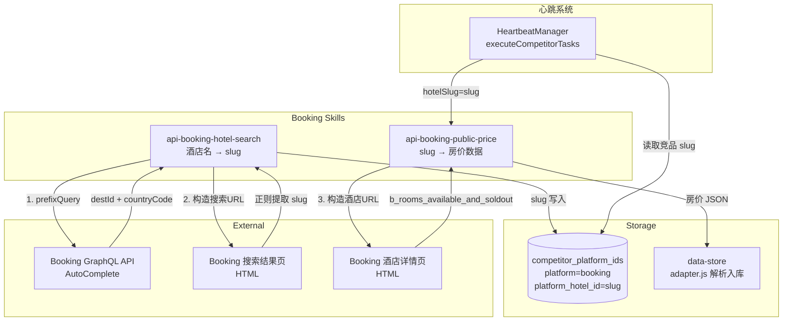
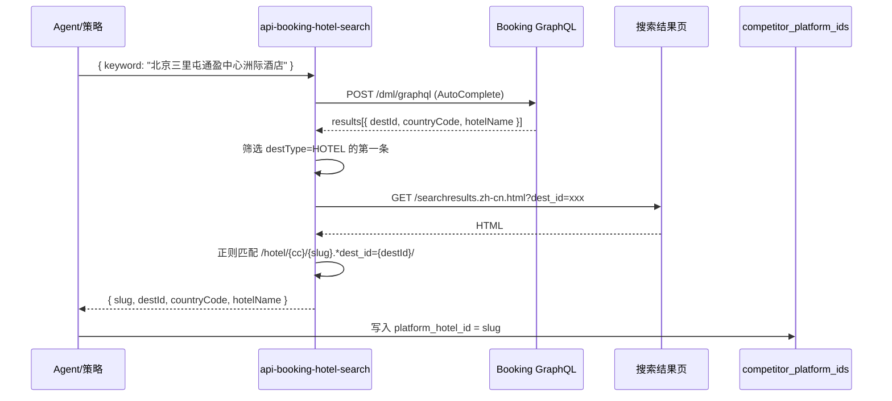
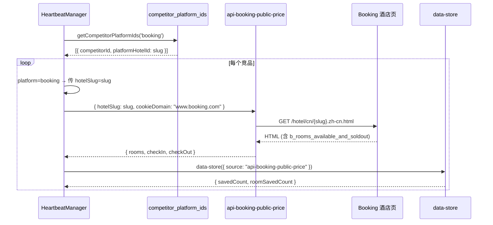

# Design Document: Booking 心跳链路数据解析流程

## Overview

本功能打通 Booking 平台在心跳系统中的完整数据采集链路。核心包含三个部分：

1. **`api-booking-hotel-search`** — 新增 skill，通过酒店名调用 Booking GraphQL AutoComplete API 获取 destId，再从搜索结果页 HTML 中提取酒店 URL slug。这是 Booking 平台特有的流程，因为 Booking 用 slug（如 `intercontinental-beijing-sanlitun`）而非数字 hotelId 来标识酒店。

2. **`api-booking-public-price`** — 已有 skill，无需修改。接收 slug 后构造酒店页面 URL，抓取 HTML 并解析 `b_rooms_available_and_soldout` JSON 数据获取房价。

3. **心跳竞品采集适配** — 修改 `heartbeat-manager.ts` 中的 `executeCompetitorTasks` 方法，使 Booking 平台传递 `hotelSlug` 而非 `hotelId`，因为 `competitor_platform_ids` 表中 Booking 平台存储的是 slug 字符串。

设计原则：只做正向新增，不改动其他平台的现有逻辑；代码简洁，能用 10 行解决不用 100 行。

## Architecture



## Sequence Diagrams

### 流程 1: 酒店搜索获取 Slug



### 流程 2: 心跳竞品采集（Booking 适配）



## Components and Interfaces

### Component 1: api-booking-hotel-search (新增)

**Purpose**: 通过酒店名搜索获取 Booking 酒店的 URL slug

**Interface**:
```typescript
// 输入参数
interface BookingHotelSearchParams {
  keyword: string;       // 酒店名关键词（必填）
  cookieDomain: string;  // Cookie 域名，用于注入（必填，值为 "www.booking.com"）
}

// 输出
interface BookingHotelSearchResult {
  success: true;
  data: {
    slug: string;         // 酒店 URL slug，如 "intercontinental-beijing-sanlitun"
    destId: string;       // Booking 内部 destination ID
    countryCode: string;  // 国家代码，如 "cn"
    hotelName: string;    // Booking 返回的酒店名
  };
}
```

**Responsibilities**:
- 调用 Booking GraphQL AutoComplete API 获取酒店 destId 和 countryCode
- 构造搜索结果页 URL 并请求 HTML
- 用正则从 HTML 中精确提取目标酒店的 slug
- 需要 Cookie 支持（skill 名以 `api-` 开头，运行时自动注入）

### Component 2: executeCompetitorTasks 适配 (修改)

**Purpose**: 让心跳竞品采集支持 Booking 平台的 slug 参数

**Interface 变更**:
```typescript
// 当前代码（所有平台统一）:
const compParams = {
  ...(task.params || {}),
  hotelId: parseInt(comp.platformHotelId) || comp.platformHotelId
};

// 修改后（Booking 平台走 slug 分支）:
const compParams = { ...(task.params || {}) };
if (task.platform === 'booking') {
  compParams.hotelSlug = comp.platformHotelId;
} else {
  compParams.hotelId = parseInt(comp.platformHotelId) || comp.platformHotelId;
}
```

**Responsibilities**:
- 识别 Booking 平台，传递 `hotelSlug` 而非 `hotelId`
- 不影响其他平台（ctrip、trip、meituan）的现有逻辑

## Data Models

### competitor_platform_ids 表（已有，无需修改）

```typescript
interface CompetitorPlatformId {
  competitor_id: number;        // 关联 competitors 表
  platform: string;             // 'booking' | 'ctrip' | 'trip' | 'meituan'
  platform_hotel_id: string;    // VARCHAR(200)，Booking 存 slug 字符串
  platform_hotel_name: string;  // Booking 返回的酒店名
}
```

**Validation Rules**:
- `platform_hotel_id` 对于 Booking 是 slug 字符串（如 `intercontinental-beijing-sanlitun`），对于其他平台是数字 ID
- `platform` 字段值为 `'booking'`
- slug 格式：小写字母、数字、连字符组成，如 `/^[a-z0-9-]+$/`

### GraphQL AutoComplete 响应结构

```typescript
interface AutoCompleteResponse {
  data: {
    autoCompleteSuggestions: {
      results: Array<{
        destination: {
          countryCode: string;  // "cn"
          destId: string;       // "-1898553"
          destType: string;     // "HOTEL" | "CITY" | ...
        };
        displayInfo: {
          title: string;        // 酒店名
          label: string;        // 地址描述
        };
      }>;
    };
  };
}
```

## Key Functions with Formal Specifications

### Function 1: searchBookingHotel (api-booking-hotel-search/index.js)

```javascript
async function searchBookingHotel(keyword) → { slug, destId, countryCode, hotelName }
```

**Preconditions:**
- `keyword` 非空字符串
- `BROWSER_COOKIES` 环境变量包含有效的 www.booking.com Cookie

**Postconditions:**
- 返回的 `slug` 匹配 `/^[a-z0-9][a-z0-9-]+$/`
- 返回的 `destId` 非空
- 返回的 `countryCode` 为 2 位小写字母
- 如果 GraphQL 无酒店结果，输出 `NO_HOTEL_RESULTS` 错误
- 如果搜索结果页被 WAF 拦截，输出 `WAF_BLOCKED` 错误
- 如果 HTML 中未找到 slug，输出 `NO_SLUG_FOUND` 错误

### Function 2: executeCompetitorTasks 中的 Booking 分支

```typescript
// 在 executeCompetitorTasks 内部
if (task.platform === 'booking') {
  compParams.hotelSlug = comp.platformHotelId;
} else {
  compParams.hotelId = parseInt(comp.platformHotelId) || comp.platformHotelId;
}
```

**Preconditions:**
- `task.platform` 已定义
- `comp.platformHotelId` 对于 Booking 是有效的 slug 字符串

**Postconditions:**
- Booking 平台：`compParams.hotelSlug` 为 slug 字符串，无 `hotelId` 字段
- 其他平台：`compParams.hotelId` 保持原有逻辑，无 `hotelSlug` 字段
- 不影响 `compParams` 中的其他字段（cookieDomain 等）


## Algorithmic Pseudocode

### Algorithm 1: 酒店搜索获取 Slug（api-booking-hotel-search/index.js）

```javascript
// 完整流程：keyword → GraphQL → destId → 搜索结果页 → slug
async function main(params) {
  const keyword = params.keyword;
  if (!keyword) return outputError('MISSING_PARAM', 'keyword is required');

  // Step 1: GraphQL AutoComplete
  const gqlResp = await runtime.fetch('https://www.booking.com/dml/graphql?aid=304142&lang=zh-cn', {
    method: 'POST',
    headers: { 'content-type': 'application/json', 'origin': 'https://www.booking.com' },
    body: JSON.stringify({
      operationName: 'AutoComplete',
      variables: { input: { prefixQuery: keyword, nbSuggestions: 5 } },
      query: AUTOCOMPLETE_QUERY  // 见下方完整 query
    })
  });

  const results = gqlResp.data?.data?.autoCompleteSuggestions?.results || [];
  const hotels = results.filter(r => r.destination?.destType === 'HOTEL');
  if (hotels.length === 0) return outputError('NO_HOTEL_RESULTS');

  const { destId, countryCode } = hotels[0].destination;
  const hotelName = hotels[0].displayInfo?.title || '';

  // Step 2: 搜索结果页提取 slug
  const checkIn = tomorrow();  // 动态计算
  const checkOut = dayAfterTomorrow();
  const searchUrl = `https://www.booking.com/searchresults.zh-cn.html?ss=${encodeURIComponent(hotelName)}&dest_id=${destId}&dest_type=hotel&checkin=${checkIn}&checkout=${checkOut}&search_selected=true`;

  const searchResp = await runtime.fetch(searchUrl, { method: 'GET', headers: BROWSER_HEADERS });
  const html = searchResp.data;

  // WAF 检测
  if (html.length < 10000 && html.includes('challenge.js')) {
    return outputError('WAF_BLOCKED');
  }

  // 精确正则：匹配包含目标 destId 的酒店链接
  const pattern = new RegExp(`/hotel/${countryCode}/([a-z0-9-]+)\\..*?dest_id=${destId}`, 'i');
  const match = html.match(pattern);
  if (match) return output({ slug: match[1], destId, countryCode, hotelName });

  // 降级：取搜索结果页中第一个酒店 slug
  const fallbackPattern = new RegExp(`/hotel/${countryCode}/([a-z0-9][a-z0-9-]{3,})\\.`, 'g');
  const allSlugs = [...new Set([...html.matchAll(fallbackPattern)].map(m => m[1]))];
  if (allSlugs.length > 0) return output({ slug: allSlugs[0], destId, countryCode, hotelName });

  return outputError('NO_SLUG_FOUND');
}
```

### Algorithm 2: executeCompetitorTasks Booking 适配

```typescript
// heartbeat-manager.ts 中 executeCompetitorTasks 方法内
// 仅修改 compParams 构造部分，其余逻辑不变

for (const comp of competitors) {
  const compParams: Record<string, any> = { ...(task.params || {}) };

  // Booking 平台用 slug，其他平台用 hotelId
  if (task.platform === 'booking') {
    compParams.hotelSlug = comp.platformHotelId;
  } else {
    compParams.hotelId = parseInt(comp.platformHotelId) || comp.platformHotelId;
  }

  const apiResult = await this.skillManager.executeSkill(task.skill, compParams);
  // ... 后续入库逻辑不变
}
```

## Example Usage

### 使用 api-booking-hotel-search 查询酒店 slug

```javascript
// 调用方式（通过 SkillExecutor）
const result = await skillManager.executeSkill('api-booking-hotel-search', {
  keyword: '北京三里屯通盈中心洲际酒店',
  cookieDomain: 'www.booking.com'
});

// 成功返回
// {
//   success: true,
//   data: {
//     slug: 'intercontinental-beijing-sanlitun',
//     destId: '-1898553',
//     countryCode: 'cn',
//     hotelName: '北京三里屯通盈中心洲际酒店'
//   }
// }
```

### 心跳竞品采集流程

```typescript
// 心跳触发 api-booking-public-price 本店采集成功后
// executeCompetitorTasks 自动展开竞品采集

// 1. 查询 competitor_platform_ids 表
// SELECT * FROM competitor_platform_ids WHERE platform = 'booking'
// → [{ competitorId: 1, platformHotelId: 'intercontinental-beijing-sanlitun' }]

// 2. 构造参数（Booking 分支）
// compParams = { cookieDomain: 'www.booking.com', hotelSlug: 'intercontinental-beijing-sanlitun' }

// 3. 调用 api-booking-public-price（已有 skill，无需修改）
// → 返回房价数据

// 4. data-store 入库
```

## Correctness Properties

*A property is a characteristic or behavior that should hold true across all valid executions of a system—essentially, a formal statement about what the system should do. Properties serve as the bridge between human-readable specifications and machine-verifiable correctness guarantees.*

### Property 1: HOTEL 类型筛选正确性

*For any* array of GraphQL AutoComplete results containing a mix of destTypes (HOTEL, CITY, REGION, etc.), the filter function SHALL return only results where `destination.destType === 'HOTEL'`, and the returned array SHALL be a subset of the input array with no elements added or reordered.

**Validates: Requirement 1.2**

### Property 2: Slug 提取与格式不变性

*For any* HTML string containing hotel links in the format `/hotel/{countryCode}/{slug}.xxx`, the slug extraction pipeline SHALL either return a slug matching `/^[a-z0-9][a-z0-9-]+$/` or return an error. When the HTML contains a link with the target `dest_id`, the precise match SHALL be preferred; when no precise match exists but fallback links are present, the first fallback slug SHALL be returned.

**Validates: Requirements 2.2, 2.3, 2.6**

### Property 3: WAF 检测正确性

*For any* HTML response string, the WAF detection SHALL return `WAF_BLOCKED` if and only if the HTML length is less than 10000 bytes AND the HTML contains the string `challenge.js`. HTML responses of 10000 bytes or greater SHALL never trigger WAF detection regardless of content.

**Validates: Requirements 3.1, 3.2**

### Property 4: 平台参数隔离性

*For any* task platform and competitor `platformHotelId`, when platform is `booking` the constructed `compParams` SHALL have `hotelSlug` equal to `platformHotelId` and `hotelId` SHALL be undefined; when platform is any value other than `booking`, `compParams` SHALL have `hotelId` set via `parseInt(platformHotelId) || platformHotelId` and `hotelSlug` SHALL be undefined.

**Validates: Requirements 5.1, 5.2, 5.3, 5.4**

## Error Handling

### Error 1: GraphQL 无酒店结果 (NO_HOTEL_RESULTS)

**Condition**: AutoComplete API 返回的 results 中没有 `destType === 'HOTEL'` 的条目
**Response**: 输出错误码 `NO_HOTEL_RESULTS`，附带搜索关键词
**Recovery**: 调用方可尝试缩短关键词重试（如去掉城市前缀）

### Error 2: WAF 拦截 (WAF_BLOCKED)

**Condition**: 搜索结果页 HTML < 10KB 且包含 `challenge.js`
**Response**: 输出错误码 `WAF_BLOCKED`
**Recovery**: 需要刷新浏览器中 www.booking.com 的 Cookie

### Error 3: Slug 提取失败 (NO_SLUG_FOUND)

**Condition**: 搜索结果页 HTML 中未找到匹配 destId 的酒店链接
**Response**: 输出错误码 `NO_SLUG_FOUND`
**Recovery**: 可能是搜索结果页结构变化，需要人工检查 HTML

### Error 4: 竞品采集单条失败

**Condition**: 某个竞品的 API 调用或入库失败
**Response**: 打 warn 日志，继续处理下一个竞品（已有逻辑，不变）
**Recovery**: 不触发 Agent Recovery，避免错误 slug 导致无效修复

## Testing Strategy

### Unit Testing

- **api-booking-hotel-search**: 用 mock HTML 测试 slug 提取正则的三种策略（精确匹配、属性匹配、降级匹配）
- **executeCompetitorTasks**: 验证 Booking 平台传 `hotelSlug`，其他平台传 `hotelId`

### Integration Testing

- 端到端测试：用已知酒店名（如"北京三里屯通盈中心洲际酒店"）调用 `api-booking-hotel-search`，验证返回 slug 为 `intercontinental-beijing-sanlitun`
- 心跳竞品采集：在 `competitor_platform_ids` 表中写入 Booking slug，触发心跳任务，验证能正确采集到房价

## Dependencies

| 依赖 | 类型 | 说明 |
|------|------|------|
| `scripts/api-runtime/index.js` | 内部 | HTTP 请求运行时（已有） |
| `scripts/api-booking-public-price/` | 内部 | Booking 房价抓取 skill（已有，无需修改） |
| `src/main/heartbeat/heartbeat-manager.ts` | 内部 | 心跳管理器（需修改 executeCompetitorTasks） |
| Booking GraphQL API | 外部 | AutoComplete 接口，需要 Cookie |
| Booking 搜索结果页 | 外部 | HTML 页面，需要 Cookie |

## 文件变更清单

| 文件 | 操作 | 影响范围 |
|------|------|----------|
| `scripts/api-booking-hotel-search/index.js` | **新增** | 无影响，纯新增文件 |
| `skills/api-booking-hotel-search/SKILL.md` | **新增** | 无影响，纯新增文件 |
| `src/main/heartbeat/heartbeat-manager.ts` | **修改** | 仅修改 `executeCompetitorTasks` 中 compParams 构造部分（3 行），其他平台逻辑不变 |
