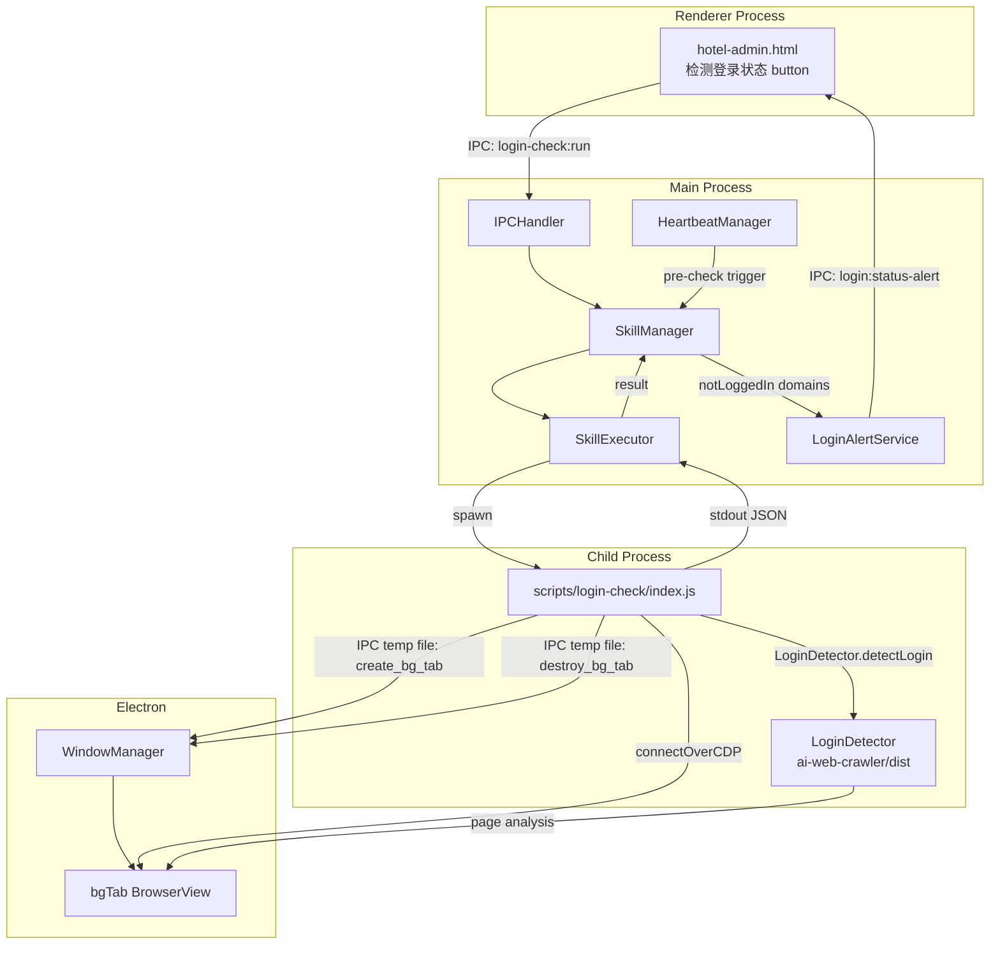
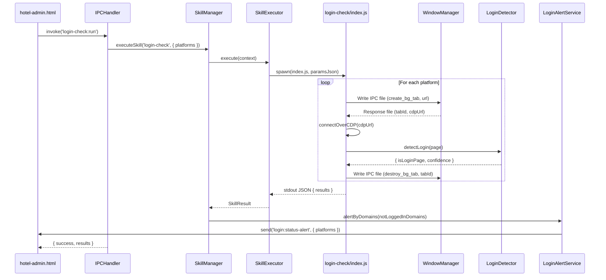
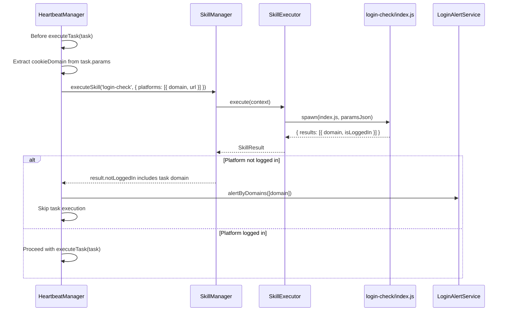
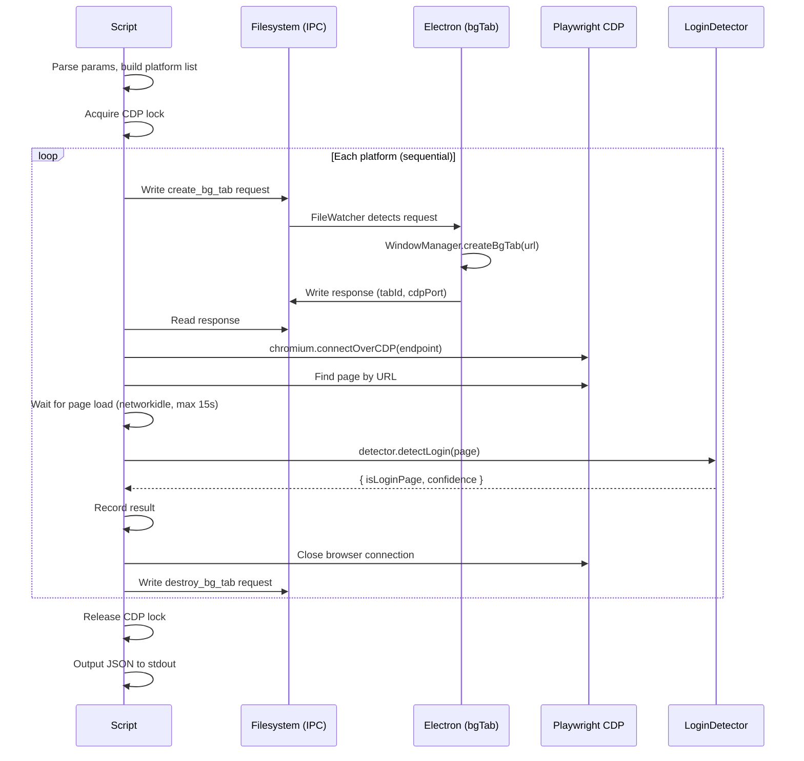

# Design Document: login-check-skill

## Overview

The login-check-skill is an independent skill that detects whether the user is logged into various OTA platforms (携程, 美团, Booking, Trip.com) by opening background tabs, navigating to each platform URL, and running the existing `LoginDetector` against the loaded page. It reuses the project's established patterns: IPC temp files for bgTab creation, CDP connection via Playwright's `connectOverCDP`, and the compiled `LoginDetector` from `ai-web-crawler/dist/login-detector.js`.

The skill runs as a child process spawned by `SkillExecutor`, receives a list of platform `{ domain, url }` pairs, checks each sequentially, and outputs a JSON result indicating which platforms require login. The main process then feeds the "not logged in" domains into the existing `LoginAlertService` to show the popup.

Four trigger scenarios are supported: manual button click from hotel-admin.html, heartbeat pre-check before task execution, application startup, and re-check after login alert dismissal.

## Architecture



## Sequence Diagrams

### Manual Trigger Flow



### Heartbeat Pre-Check Flow



## Components and Interfaces

### Component 1: login-check Skill Script (`scripts/login-check/index.js`)

**Purpose**: Child process entry point. Receives platform list, checks each via bgTab + LoginDetector, outputs JSON result.

**Interface**:
```javascript
// Input: process.argv[2] = JSON string
// {
//   platforms: Array<{ domain: string, url: string, name?: string }>
// }

// Output: stdout JSON
// {
//   success: boolean,
//   results: Array<{
//     domain: string,
//     url: string,
//     name: string,
//     isLoggedIn: boolean,
//     confidence: number,
//     error?: string
//   }>,
//   summary: {
//     total: number,
//     loggedIn: number,
//     notLoggedIn: number,
//     errors: number
//   }
// }
```

**Responsibilities**:
- Parse input parameters from `process.argv[2]`
- For each platform: request bgTab via IPC temp file, wait for response, connect via CDP, run LoginDetector, close bgTab
- Handle timeouts and errors per-platform (one failure doesn't block others)
- Output structured JSON result to stdout

### Component 2: SKILL.md Definition (`skills/login-check/SKILL.md`)

**Purpose**: Skill metadata for SkillLoader to register the skill.

**Interface**:
```yaml
---
name: login-check
description: 检测各OTA平台登录状态。逐个打开后台标签页检测是否为登录页面，返回各平台登录状态。
script: scripts/login-check/index.js
type: tool
user-invocable: false
parameters:
  platforms:
    type: array
    description: "平台列表，每项包含 domain 和 url"
    required: false
---
```

**Responsibilities**:
- Declare skill metadata for registration
- Define parameter schema
- `user-invocable: false` — triggered programmatically, not by user chat

### Component 3: IPC Handler Extension (`src/main/ipc-handler.ts`)

**Purpose**: Register the `login-check:run` IPC channel for manual trigger from hotel-admin.html.

**Interface**:
```javascript
// IPC Channel: 'login-check:run'
// Input: none (uses default platform list from schedule.json)
// Output: { success: boolean, results: Array<PlatformCheckResult> }
```

**Responsibilities**:
- Handle `ipcMain.handle(IPC_CHANNELS.LOGIN_CHECK_RUN, ...)`
- Build platform list from `tasks/schedule.json` (extract unique `cookieDomain` + `startUrl` pairs)
- Call `skillManager.executeSkill('login-check', { platforms })`
- Feed not-logged-in domains to `LoginAlertService.alertByDomains()`
- Return result to renderer

### Component 4: UI Button (`src/renderer/pages/hotel-admin.html`)

**Purpose**: "检测登录状态" button in the control panel for manual trigger.

**Responsibilities**:
- Render button in the platform config section
- Call `window.electronAPI.loginCheck.run()` on click
- Show loading state during check
- Display result summary via toast

## Data Models

### PlatformCheckInput

```javascript
// Input to the skill
{
  platforms: [
    { domain: "ebooking.ctrip.com", url: "https://ebooking.ctrip.com/", name: "携程后台" },
    { domain: "hotels.ctrip.com", url: "https://hotels.ctrip.com/", name: "携程公网" },
    { domain: "ehotel.meituan.com", url: "https://ehotel.meituan.com/", name: "美团商家" },
    { domain: "pms.meituan.com", url: "https://pms.meituan.com/", name: "美团PMS" },
    { domain: "admin.booking.com", url: "https://admin.booking.com/", name: "Booking后台" },
    { domain: "www.booking.com", url: "https://www.booking.com/", name: "Booking公网" },
    { domain: "www.trip.com", url: "https://www.trip.com/", name: "Trip.com" }
  ]
}
```

**Validation Rules**:
- `platforms` array must be non-empty
- Each entry must have non-empty `domain` and `url`
- `url` must start with `https://`
- If `platforms` is omitted, use the default full list

### PlatformCheckResult

```javascript
// Output per platform
{
  domain: "ebooking.ctrip.com",
  url: "https://ebooking.ctrip.com/",
  name: "携程后台",
  isLoggedIn: false,       // true = NOT a login page, false = IS a login page
  confidence: 0.85,        // LoginDetector confidence score
  error: null              // or error message string if check failed
}
```

### SkillOutput

```javascript
// Full stdout JSON
{
  success: true,
  results: [ /* PlatformCheckResult[] */ ],
  summary: {
    total: 7,
    loggedIn: 4,
    notLoggedIn: 2,
    errors: 1
  }
}
```

## Main Algorithm/Workflow



## Key Functions with Formal Specifications

### Function 1: checkPlatform(platform, cdpPort)

```javascript
async function checkPlatform(platform, cdpPort) {
  // Returns: { domain, url, name, isLoggedIn, confidence, error }
}
```

**Preconditions:**
- `platform` has non-empty `domain`, `url`, and `name`
- `cdpPort` is a valid port number (default 9222)
- Electron main process is running with FileWatcher active

**Postconditions:**
- Returns a result object with `isLoggedIn` boolean
- `isLoggedIn = true` means LoginDetector confidence < threshold (NOT a login page)
- `isLoggedIn = false` means LoginDetector confidence >= threshold (IS a login page)
- bgTab is always destroyed, even on error (finally block)
- If any step fails, `error` contains the message and `isLoggedIn` defaults to `true` (fail-open: don't block on errors)

**Loop Invariants:** N/A (no loops within this function)

### Function 2: requestBgTab(url, sessionId)

```javascript
async function requestBgTab(url, sessionId) {
  // Returns: { tabId } or throws on timeout
}
```

**Preconditions:**
- `url` is a valid HTTPS URL
- `sessionId` is a unique string for this check session
- Electron FileWatcher is polling temp directory

**Postconditions:**
- IPC request file written to `os.tmpdir()`
- Response file contains `tabId` from Electron
- Request file is cleaned up after reading response
- Throws if no response within 15 seconds

### Function 3: destroyBgTab(tabId, sessionId)

```javascript
async function destroyBgTab(tabId, sessionId) {
  // Fire-and-forget cleanup
}
```

**Preconditions:**
- `tabId` was returned by a previous `requestBgTab` call
- `sessionId` matches the session used in creation

**Postconditions:**
- IPC destroy request file written
- Does not wait for confirmation (fire-and-forget)
- Never throws (errors are silently caught)

## Algorithmic Pseudocode

### Main Processing Algorithm

```pascal
ALGORITHM loginCheckMain(params)
INPUT: params containing platforms array
OUTPUT: JSON result to stdout

BEGIN
  platforms ← parsePlatforms(params)
  IF platforms is empty THEN
    platforms ← DEFAULT_PLATFORMS
  END IF

  sessionId ← "login-check-" + timestamp
  cdpPort ← env.CDP_PORT or 9222
  results ← []

  acquireCdpLock(sessionId)

  FOR each platform IN platforms DO
    TRY
      result ← checkPlatform(platform, cdpPort, sessionId)
      results.add(result)
    CATCH error
      results.add({
        domain: platform.domain,
        url: platform.url,
        name: platform.name,
        isLoggedIn: true,
        confidence: 0,
        error: error.message
      })
    END TRY
  END FOR

  releaseCdpLock()

  summary ← computeSummary(results)
  output({ success: true, results, summary })
END
```

### Platform Check Algorithm

```pascal
ALGORITHM checkPlatform(platform, cdpPort, sessionId)
INPUT: platform {domain, url, name}, cdpPort, sessionId
OUTPUT: PlatformCheckResult

BEGIN
  tabId ← null

  TRY
    tabId ← requestBgTab(platform.url, sessionId)
    
    browser ← connectOverCDP("http://localhost:" + cdpPort)
    contexts ← browser.contexts()
    page ← findPageByUrl(contexts, platform.url)
    
    IF page is null THEN
      THROW "Could not find page for " + platform.url
    END IF

    waitForLoad(page, timeout: 15000)

    detector ← new LoginDetector()
    detection ← detector.detectLogin(page)

    browser.close()

    RETURN {
      domain: platform.domain,
      url: platform.url,
      name: platform.name,
      isLoggedIn: NOT detection.isLoginPage,
      confidence: detection.confidence,
      error: null
    }
  CATCH error
    RETURN {
      domain: platform.domain,
      url: platform.url,
      name: platform.name,
      isLoggedIn: true,
      confidence: 0,
      error: error.message
    }
  FINALLY
    IF tabId is not null THEN
      destroyBgTab(tabId, sessionId)
    END IF
  END TRY
END
```

## Example Usage

### Skill Script (scripts/login-check/index.js)

```javascript
"use strict";

const path = require("path");
const fs = require("fs");
const os = require("os");

const crawlerDist = path.resolve(__dirname, "..", "ai-web-crawler", "dist");
const crawlerNodeModules = path.resolve(__dirname, "..", "ai-web-crawler", "node_modules");

function output(obj) {
  process.stdout.write(JSON.stringify(obj) + "\n");
}

const DEFAULT_PLATFORMS = [
  { domain: "ebooking.ctrip.com", url: "https://ebooking.ctrip.com/", name: "携程后台" },
  { domain: "hotels.ctrip.com", url: "https://hotels.ctrip.com/", name: "携程公网" },
  { domain: "ehotel.meituan.com", url: "https://ehotel.meituan.com/", name: "美团商家" },
  { domain: "pms.meituan.com", url: "https://pms.meituan.com/", name: "美团PMS" },
  { domain: "admin.booking.com", url: "https://admin.booking.com/", name: "Booking后台" },
  { domain: "www.booking.com", url: "https://www.booking.com/", name: "Booking公网" },
  { domain: "www.trip.com", url: "https://www.trip.com/", name: "Trip.com" },
];

(async () => {
  try {
    const params = JSON.parse(process.argv[2] || "{}");
    const platforms = params.platforms && params.platforms.length > 0
      ? params.platforms
      : DEFAULT_PLATFORMS;

    const sessionId = `login-check-${Date.now()}`;
    const cdpPort = parseInt(process.env.SMART_PRICE_CDP_PORT || "9222", 10);
    const results = [];

    for (const platform of platforms) {
      const result = await checkPlatform(platform, cdpPort, sessionId);
      results.push(result);
    }

    const summary = {
      total: results.length,
      loggedIn: results.filter(r => r.isLoggedIn && !r.error).length,
      notLoggedIn: results.filter(r => !r.isLoggedIn).length,
      errors: results.filter(r => r.error).length,
    };

    output({ success: true, results, summary });
  } catch (e) {
    output({ success: false, error: e.message || String(e) });
    process.exitCode = 1;
  }
})();
```

### IPC Handler (main process)

```javascript
// In ipc-handler.ts — registerLoginCheckHandlers()
ipcMain.handle(IPC_CHANNELS.LOGIN_CHECK_RUN, async () => {
  const result = await this.skillManager.executeSkill('login-check', {});
  if (result.success && result.output?.results) {
    const notLoggedIn = result.output.results
      .filter(r => !r.isLoggedIn)
      .map(r => r.domain);
    if (notLoggedIn.length > 0) {
      this.loginAlertService.alertByDomains(notLoggedIn);
    }
  }
  return result;
});
```

### UI Button (hotel-admin.html)

```html
<button class="btn btn-primary" id="loginCheckBtn" onclick="runLoginCheck()">
  🔐 检测登录状态
</button>

<script>
async function runLoginCheck() {
  const btn = document.getElementById('loginCheckBtn');
  btn.disabled = true;
  btn.textContent = '检测中...';
  try {
    const result = await window.electronAPI.loginCheck.run();
    if (result.success) {
      showToast(`检测完成: ${result.output.summary.loggedIn}个已登录, ${result.output.summary.notLoggedIn}个未登录`, 'info');
    }
  } catch (e) {
    showToast('检测失败: ' + e.message, 'error');
  } finally {
    btn.disabled = false;
    btn.textContent = '🔐 检测登录状态';
  }
}
</script>
```

## Correctness Properties

*A property is a characteristic or behavior that should hold true across all valid executions of a system — essentially, a formal statement about what the system should do. Properties serve as the bridge between human-readable specifications and machine-verifiable correctness guarantees.*

### Property 1: Login status inversion

*For any* Platform and any LoginDetector result, the PlatformCheckResult's `isLoggedIn` field SHALL equal the logical negation of `isLoginPage`. That is, `isLoggedIn === !detection.isLoginPage` for all successful detections.

**Validates: Requirements 1.3, 1.4**

### Property 2: Output count invariant

*For any* input platforms array of length N (after validation filtering), the Login_Check_Skill SHALL produce a results array of exactly length N, regardless of whether individual checks succeed or fail.

**Validates: Requirements 1.5, 2.5**

### Property 3: Summary arithmetic invariant

*For any* results array produced by the Login_Check_Skill, the summary object SHALL satisfy: `summary.loggedIn + summary.notLoggedIn + summary.errors === summary.total`, and `summary.total === results.length`.

**Validates: Requirement 1.6**

### Property 4: Default platform fallback

*For any* input where the `platforms` parameter is undefined, null, or an empty array, the Login_Check_Skill SHALL use the default platform list. *For any* input with a non-empty valid platforms array, the Login_Check_Skill SHALL use the provided list.

**Validates: Requirement 1.2**

### Property 5: Input validation filtering

*For any* platform entry in the input array, if `domain` is empty, `url` is empty, or `url` does not start with `https://`, the Login_Check_Skill SHALL exclude that entry from processing. All remaining valid entries SHALL be checked.

**Validates: Requirements 9.1, 9.2, 9.3**

### Property 6: Not-logged-in domain filtering for alerts

*For any* results array returned by the Login_Check_Skill, the set of domains passed to LoginAlertService.alertByDomains SHALL be exactly the set of domains where `isLoggedIn === false` (excluding entries with errors).

**Validates: Requirement 5.2**

## Error Handling

### Error Scenario 1: bgTab Creation Timeout

**Condition**: Electron FileWatcher doesn't respond within 15 seconds (main process busy or crashed).
**Response**: The platform check returns `{ isLoggedIn: true, error: "bgTab creation timeout" }`.
**Recovery**: Fail-open — the platform is treated as logged in. The next scheduled check will retry.

### Error Scenario 2: CDP Connection Failure

**Condition**: `connectOverCDP` fails (port not available, Electron not exposing CDP).
**Response**: The platform check returns `{ isLoggedIn: true, error: "CDP connection failed" }`.
**Recovery**: Fail-open. The CDP port is read from `SMART_PRICE_CDP_PORT` env var (default 9222).

### Error Scenario 3: Page Load Timeout

**Condition**: Platform URL takes longer than 15 seconds to reach `networkidle` state.
**Response**: Run LoginDetector on whatever has loaded so far. If detection fails, return `{ isLoggedIn: true, error: "page load timeout" }`.
**Recovery**: Partial detection may still work (login pages typically load fast). bgTab is destroyed in finally block.

### Error Scenario 4: LoginDetector Throws

**Condition**: LoginDetector encounters an unexpected error during DOM evaluation.
**Response**: Return `{ isLoggedIn: true, confidence: 0, error: "detection failed" }`.
**Recovery**: Fail-open. The error is logged to stderr for debugging.

### Error Scenario 5: CDP Lock Contention

**Condition**: Another skill (ai-web-crawler, smart-price-adjust) holds the CDP lock.
**Response**: Wait up to 30 seconds for the lock to be released. If still locked, abort with error.
**Recovery**: The check can be retried later. Heartbeat pre-check will simply skip and proceed with the task.

## Testing Strategy

### Unit Testing Approach

- Test `parsePlatforms()` with valid, empty, and malformed input
- Test `computeSummary()` with various result combinations
- Test IPC file write/read helpers with mock filesystem
- Test default platform list completeness

### Property-Based Testing Approach

**Property Test Library**: fast-check

- **Property 1 (Login status inversion)**: For any LoginDetector result, `isLoggedIn === !isLoginPage` — Feature: login-check-skill, Property 1: Login status inversion
- **Property 2 (Output count invariant)**: For any list of N valid platforms, the output always contains exactly N results — Feature: login-check-skill, Property 2: Output count invariant
- **Property 3 (Summary arithmetic invariant)**: For any results array, `loggedIn + notLoggedIn + errors === total === results.length` — Feature: login-check-skill, Property 3: Summary arithmetic invariant
- **Property 4 (Default platform fallback)**: For any empty/null/undefined platforms input, the default list is used; for any non-empty valid input, the provided list is used — Feature: login-check-skill, Property 4: Default platform fallback
- **Property 5 (Input validation filtering)**: For any platform entry with empty domain, empty url, or non-https url, the entry is excluded from processing — Feature: login-check-skill, Property 5: Input validation filtering
- **Property 6 (Not-logged-in domain filtering)**: For any results array, the domains sent to alertByDomains are exactly those where isLoggedIn is false — Feature: login-check-skill, Property 6: Not-logged-in domain filtering

Minimum 100 iterations per property test.

### Integration Testing Approach

- Mock Electron FileWatcher to test bgTab IPC request/response cycle
- Test with a local HTTP server that serves a login page (password input + login button) and a non-login page
- Verify LoginDetector correctly identifies both cases through the full CDP pipeline
- Test timeout handling by introducing artificial delays

## Performance Considerations

- Each platform check involves: bgTab creation (~1s) + page load (~2-5s) + detection (~100ms) + cleanup (~500ms). Total per platform: ~3-7 seconds.
- For 7 platforms, worst case is ~50 seconds. This is acceptable for a manual trigger but may be too slow for heartbeat pre-check.
- **Optimization for heartbeat**: Only check the specific platform needed for the upcoming task (1 platform = ~5s), not all 7.
- **Optimization for startup**: Run checks in background, don't block app initialization.
- bgTabs are created and destroyed sequentially to minimize memory usage (only 1 BrowserView at a time).

## Security Considerations

- The skill runs with `ELECTRON_RUN_AS_NODE=1` in a sandboxed child process — no access to Electron APIs directly.
- CDP connection is localhost-only (`http://localhost:9222`), no external network exposure.
- No credentials are read or transmitted. LoginDetector only inspects DOM structure (password inputs, login buttons).
- IPC temp files are written to `os.tmpdir()` with unique request IDs to prevent collisions.

## Dependencies

- **Playwright** (`chromium.connectOverCDP`): Already available in `scripts/ai-web-crawler/node_modules/`
- **LoginDetector**: Compiled JS at `scripts/ai-web-crawler/dist/login-detector.js`
- **Electron FileWatcher**: Existing IPC mechanism in `WindowManager` for bgTab management
- **LoginAlertService**: Existing alert service in main process
- No new npm dependencies required
